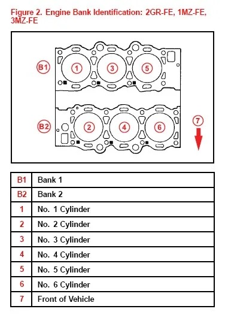

[Cars](Cars.md)

# Troubleshooting P0352

OBD code P0352 indicates: Ignition Coil B Primary/Secondary Circuit Malfunction

|     | description                         |
| :-- | :--                                 |
| P   | powertrain                          |
| 0   | generic (not manufacturer specific) |
| 3   | ignition system                     |
| 5   | *unknown*                           |
| 2   | cylinder 2                          |

## Potential causes

- Defective ignition coil(s)
- Defective spark plug
- Damaged/corroded/worn coil wiring 
- Loose wiring connection or short
- Defective idle air control valve 
- Carbon buildup in the throttle body

For more information see this helpful article from [identifix.com](https://www.identifix.com/blogs/code-p0352-the-diagnostic-and-repair-guide).

