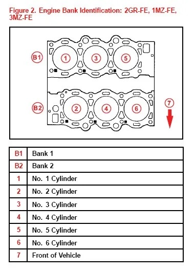

OBD code P0352 indicates: Ignition Coil B Primary/Secondary Circuit
Malfunction.[^1]

[^1]: More information about this code:
  <https://www.identifix.com/blogs/code-p0352-the-diagnostic-and-repair-guide>

  -----------------------------------------
      description
  --- -------------------------------------
  P   powertrain

  0   generic (not manufacturer specific)

  3   ignition system

  5   *unknown*

  2   cylinder 2
  -----------------------------------------

Note the position of cylinder 2 on the below graph.

# Potential causes

- Defective ignition coil
- Defective spark plug
- Damaged/corroded/worn coil wiring 
- Loose wiring connection or short
- Defective idle air control valve 
- Carbon buildup in the throttle body

A defective ignition coil is generally considered the most common cause
of this error. However, ignition coils can fail due to bad spark plugs.
Try swapping the suspect coil to a different cylinder to rule out spark
plugs and faulty wiring.[^2]

[^2]: To change spark plugs (and ignition coils) see:
  [[how-to-replace-spark-plugs-on-a-toyota-2gr-fe]]
